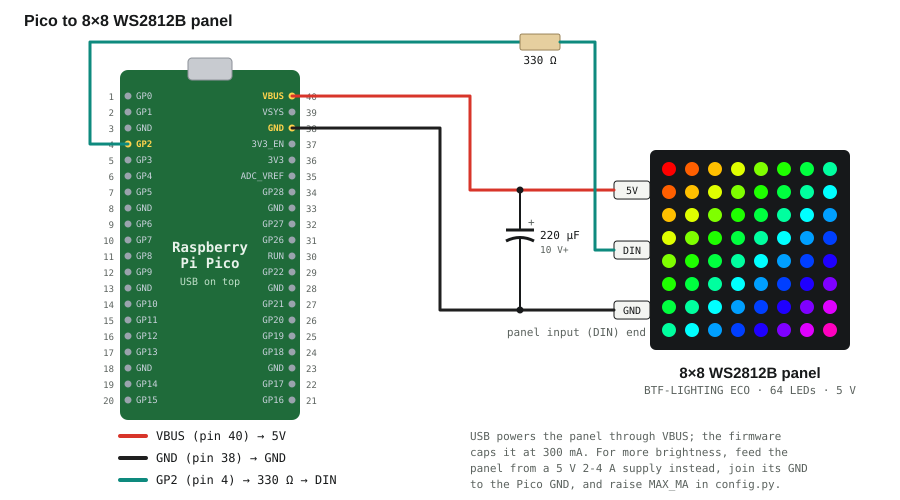
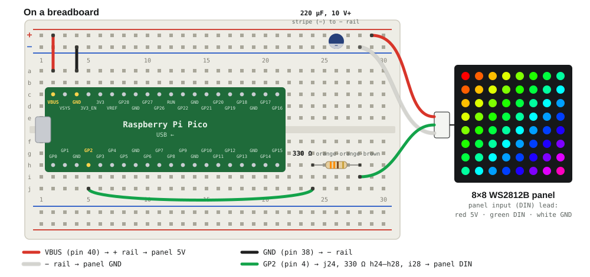

# pico-ws2812-matrix

An 8×8 WS2812B RGB LED panel driven by a Raspberry Pi Pico in MicroPython,
starting with a sign for the YouTube channel **Paradox Transistor Lab**: a
rainbow wipe, the play-button logo, then the logo sliding out to the left with
the channel name right behind it in a rainbow, as one continuous ticker.


*Rendered on a computer by `preview.py` from the same code the Pico runs, so
this is exactly what the panel shows (one 12 s cycle).*

## Hardware

| Part | Notes |
|---|---|
| Raspberry Pi Pico (RP2040) | Running MicroPython (v1.29 tested on this bench). A Pico W or Pico 2 works the same |
| [BTF-LIGHTING WS2812B ECO 8×8 panel](https://www.amazon.com.mx/dp/B09XWQTZZN) | 64 addressable RGB LEDs, 5 V, flexible board, 3-wire input: 5V / DIN / GND |
| 330 Ω resistor | In series with the data line, at the panel end. Protects the first LED from ringing |
| 220 µF electrolytic capacitor, 10 V or more | Across the panel's 5V and GND. Smooths the current steps as LEDs switch, and is small enough not to cause a big surge on USB at plug-in. 100 µF also works. Use 1000 µF only with a separate 5 V supply |
| Jumper wires | |
| *Optional:* 5 V supply, 2–4 A | Only for more brightness than USB allows (see Power) |

## Wiring



| Panel | Pico | Pin |
|---|---|---|
| 5V | VBUS | 40 |
| DIN | GP2, through the 330 Ω resistor | 4 |
| GND | GND | 38 |

### On a breadboard



1. **Pico across the centre trench, USB to the left.** Its pins land in rows
   **c** and **h**, which leaves rows a–b and i–j free beside every pin.
2. **Power to the rails:** red jumper from **a2** (VBUS, pin 40) to the **+**
   rail, black jumper from **a4** (GND, pin 38) to the **−** rail.
3. **220 µF capacitor** across the two rails, striped (−) leg in the **−** rail.
4. **Data:** green jumper from **j5** (GP2, pin 4) to **j24**, then the
   **330 Ω** resistor from **h24** to **h28**.
5. **Panel lead** (input end): **red → + rail**, **white → − rail**,
   **green → i28**.

- **Orientation as set up here:** LED 0, where the input wires attach, is the
  **bottom-left** LED, and the chain runs right along the bottom row then
  zig-zags upward. `config.py` has `FLIP_Y = True` for that. If you mount the
  panel another way, run `test_matrix.py` and adjust the flips.
- **Use the panel's input end.** The flexible panel has an input (DIN) and an
  output (DOUT) connector; the arrows printed next to the LEDs point away from
  the input. Data sent into DOUT does nothing.
- **The grounds must be shared.** Without a common GND, the data line has no
  reference and the panel shows garbage or nothing.
- **3.3 V data into a 5 V panel** is out of spec on paper (WS2812B wants
  0.7 × 5 V = 3.5 V for a high) but works on most panels at short wire length.
  If the first LEDs flicker or show random colours, add a 74AHCT125 level
  shifter between GP2 and DIN.

## Power: why there is a current limit

Each WS2812B draws up to ~60 mA at full white, so all 64 can ask for
**about 3.8 A**. USB provides 500 mA, shared with the Pico itself.

`matrix.py` estimates the current of every frame before sending it (~20 mA per
colour channel at full value, plus ~0.6 mA per idle LED) and scales the frame
down to fit **`MAX_MA` (300 mA by default)**. On USB power, nothing you draw
can overload the port.

For more brightness, power the panel from a separate 5 V supply instead of
VBUS: supply 5V → panel 5V, supply GND → panel GND **and** Pico GND. Then
raise `MAX_MA` in `config.py` to what that supply can deliver. At those
currents, use a **1000 µF** capacitor in place of the 220 µF.

## Files

| File | What it does |
|---|---|
| `config.py` | Data pin, panel orientation, brightness, current limit |
| `matrix.py` | Driver: (x, y) → chain position for the zig-zag layout, brightness, current limit |
| `font.py` | Proportional 8-row pixel font, every glyph drawn as readable `#` art |
| `test_matrix.py` | Bring-up test: chain order, corners, colour order, diagonal |
| `sign.py` | The Paradox Transistor Lab sign |
| `preview.py` | Renders the sign to `docs/sign.gif` on your computer |
| `run_on_pico.sh`, `pico_port.py` | Copy the libraries to the Pico and run a script, with the serial-port workarounds this bench's Pico needs |

## Run it

Needs `mpremote` and `pyserial` on the computer
(`python3 -m pip install --user mpremote pyserial`).

**1. Test the panel first**

```bash
./run_on_pico.sh test_matrix.py
```

1. **Chain order:** the LEDs light one at a time in data order, starting at
   LED 0. Watch where it starts and how it snakes. These panels are
   *serpentine*: each row runs the opposite way to the one before.
2. **Corners:** top-left red, top-right green, bottom-left blue,
   bottom-right white. If they land elsewhere, set `FLIP_X`, `FLIP_Y` or
   `TRANSPOSE` in `config.py` until they match how you hold the panel.
3. **Colours:** the whole panel red, then green, then blue.
4. **Diagonal:** top-left to bottom-right.

**2. Run the sign**

```bash
./run_on_pico.sh sign.py        # Ctrl-C stops it and blanks the panel
```

**3. Optional: start it on power-up**

```bash
./run_on_pico.sh --install sign.py
```

This saves the sign as `main.py`, so it runs whenever the Pico gets power, for
example from a USB power bank. **Not on a Pico with a stuck BOOTSEL button:**
that board boots into the bootloader on power-up and needs
`~/pico-oled/start.sh` from the computer every time.

## Edit in VS Code

Open the folder in VS Code. The Run button would run these files on the Mac,
where `machine` and `neopixel` don't exist, so use the tasks instead:

| Task | How |
|---|---|
| Run the sign on the Pico | **Cmd+Shift+B** (default build task) |
| Run the panel test | Terminal → Run Task… → *Run panel test on Pico* |
| Run whichever file is open | Terminal → Run Task… → *Run current file on Pico* |
| Preview the animation on the Mac | Terminal → Run Task… → *Preview sign as GIF (no Pico)* |

Each Pico task boots the board if needed and copies `config.py`, `matrix.py`
and `font.py` first, so edits to those take effect on the next run. Stop a
running script with Ctrl-C in its terminal before starting another.

## Change the sign

All in `sign.py` unless noted:

| What | Where |
|---|---|
| The text | `TEXT = "Paradox Transistor Lab"` |
| Scroll speed | `SCROLL_MS` (ms per column; smaller is faster) |
| Scroll direction | `SCROLL_FROM` in `config.py`: `"right"` (normal reading order) or `"left"` |
| Text colours | `scroll()` — the rainbow comes from `hsv()`; use a fixed `(r, g, b)` for one colour |
| The logo | `LOGO`, 8 strings of `R` (red), `W` (white), `.` (off) |
| Order of the parts | `frames()` |
| Gap between logo and text, logo hold time | `LOGO_GAP`, `LOGO_HOLD_MS` |
| Brightness, current limit | `config.py` |
| New characters | `font.py` — add a `GLYPHS` entry, rows separated by `/` |

Then `python3 preview.py` re-renders `docs/sign.gif` to check it before running
it on the panel.

## Troubleshooting

| Symptom | Likely cause | Fix |
|---|---|---|
| Nothing lights | Data into the DOUT end, no shared GND, or wrong GPIO | Use the input end; join the grounds; check `DATA_PIN` |
| First LED wrong colour or flickering | 3.3 V data marginal, or no series resistor | 330 Ω at the panel; shorter data wire; 74AHCT125 |
| Image mirrored, upside down or rotated | Panel held a different way than assumed | Run `test_matrix.py` and note which colour lands in the top-left and top-right corners; set `FLIP_X`, `FLIP_Y`, `TRANSPOSE` until red is top-left and green top-right. The YouTube logo is symmetric top to bottom, so it can't show an upside-down panel; the corners can |
| Red and green swapped | Not a GRB WS2812B | Swap the first two values in `Matrix.show()` |
| Pico resets when the panel gets bright | USB supply sagging | Lower `MAX_MA`, or move the panel to a separate 5 V supply |
| A change to `config.py` / `matrix.py` / `font.py` seems to do nothing | The board was still using a copy imported by an earlier run | Run through `run_on_pico.sh`, which clears those modules before every run (older versions didn't) |
| `ModuleNotFoundError: No module named 'machine'` | Ran the file on the computer | Use `./run_on_pico.sh`; only `preview.py` runs on the computer |

## License

MIT, see [LICENSE](LICENSE).
